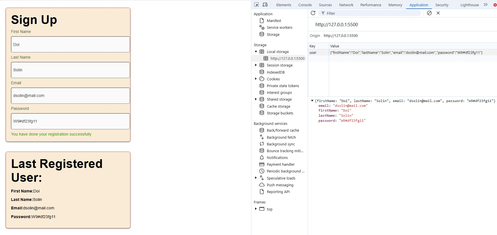

# Web-localStorage-Object
## 
Adding JSON.stringify, JSON.parse to display the last User's registration details{"objects"}

Used [Google](https://www.google.com) or another search engine to research this.
